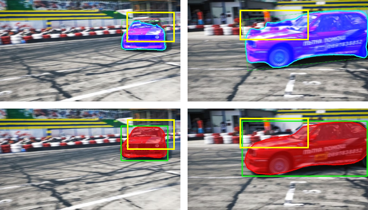

<!--
 * @Author: JosieHong
 * @Date: 2020-05-06 00:47:57
 * @LastEditAuthor: JosieHong
 * @LastEditTime: 2021-01-17 00:40:35
-->
# SiamPolar: Realtime Video Object Segmentation with Polar Representation in Traffic Scenes

This is the official code of SiamPolar based on [mmdetection](https://github.com/open-mmlab/mmdetection). 

Paper: [SiamPolar: Realtime Video Object Segmentation with Polar Representation in Traffic Scene](). 

<div align="center">
	
</div>


## Highlights

- **Improved polar representation**: We introduce a novel polar representation for video object segmentation and propose a real-time video object segmentation method named SiamPolar, which is an anchor-free object tracking method.
- **Asymmetric Siamese network**: An asymmetric Siamese network is developed using similar backbones with different depths, which not only alleviates antagonism among the branches of polar head, but also allows the siamese network to perform better with deeper backbones.
- **Peeling convolutions**: Negative effects exist among the branches of polar head, so we design repeated cross correlation and semi-FPN based on the idea of peeling convolutions. Redundant anti-features can be reduced without convolutions. As a result, the mutual influence between each branch feature can be decreased. 

## Performances on DAVIS2016

| Methods   | J_M​      | J_R​      | J_D​     | F_D​      | F_R​      | F_D​     | Speed     |
| --------- | -------- | -------- | ------- | -------- | -------- | ------- | --------- |
| SiamMask  | 71.3     | 86.8     | 3.0     | **67.8** | **79.8** | **2.1** | 55.00     |
| SiamPolar | **71.4** | **96.2** | **0.7** | 56.7     | 60.0     | 18.1    | **59.20** |

Here is the visualization of performance on DAVIS2016. The blue ones are the results of SiamMask, and the red ones are ours. SiamPolar makes more smooth outline. 

<div align="center">
	
</div>


## Setup Environment

SiamPolar is implemented on [mmdetection](https://github.com/open-mmlab/mmdetection). It can be installed easily as following, and more details can be seen in `./INSTALL.md`.

```shell
git clone https://github.com/JosieHong/SiamPolar.git
cd SiamPolar

# conda environment
conda create -n open_mmlab python=3.7 -y
conda activate open_mmlab
# or virtualenv environment
virtualenv env
source env/bin/activate

pip install --upgrade pip
pip install -r requirements.txt
pip install "git+https://github.com/cocodataset/cocoapi.git#subdirectory=PythonAPI"

python setup.py develop
# or "pip install -v -e ."
```

## Prepare DAVIS2016 Dataset

1. Download DAVIS2016 from [kaggle-DAVIS480p](https://www.kaggle.com/mrjb166/davis480p).

2. Convert DAVIS2016 to COCO format by `/tools/conver_datasets/davis2coco.py [path to DAVIS2016 dataset]` and organized it as following: (The files in brackets are not used in SiamPolar.)

```shell
SiamPolar
├── mmdet
├── tools
├── configs
├── data
│  ├── DAVIS
│  │  ├── Annotations
|  |  |  ├── 480p_train.json
|  |  |  ├── 480p_trainval.json
|  |  |  ├── 480p_val.json
|  |  |  ├── (db_info.yml)
|  |  |  ├── (480p)
│  │  ├── (Imageset)
|  |  |  ├── (480p)
|  |  |  |  ├── (train.txt)
|  |  |  |  ├── (trainval.txt)
|  |  |  |  ├── (val.txt)
|  |  |  |  ├── (test.txt)
│  │  ├── JPEGImages
|  |  |  ├── 480p
```

## Prepare SegTrack Dataset

1. Download [SegTrack Dataset](http://cpl.cc.gatech.edu/projects/SegTrack/).
2. Convert SegTrack to COCO format: 

```bash
# First thing is that change the file name 'ground_truth' in penguin into 'ground-truth'.

python tools/convert_datasets/segtrack2coco.py [path to SegTrack dataset]
# e.g.
# python tools/convert_datasets/segtrack2coco.py /data1/datasets/SegTrack
```

## Train & Test

It can be trained and test as other mmdetection models. For more details, you can read [mmdetection-manual](https://mmdetection.readthedocs.io/en/latest/INSTALL.html) and [mmcv-manual](https://mmcv.readthedocs.io/en/latest/image.html). This is an example of SiamPolarMask(ResNet101 Backbone). 

```shell
# DAVIS2016
python tools/train.py ./configs/siampolar/siampolar_r101.py --gpus 1
python tools/test.py ./configs/siampolar/siampolar_r101.py ./work_dirs/asy_r101_semi/epoch_36.pth \
--out ./work_dirs/davis/res.pkl \
--eval vos

# TSD-max
python tools/train.py ./configs/siampolar/siampolar_r101_tsd-max.py --gpus 1
python tools/test.py ./configs/siampolar/siampolar_r101_tsd-max.py ./work_dirs/tsd_max/epoch_36.pth \
--out ./work_dirs/tsd_max/res.pkl \
--eval vos

# SegTrack
python tools/train.py ./configs/siampolar/siampolar_r101_segtrack.py --gpus 1
python tools/test.py ./configs/siampolar/siampolar_r101_segtrack.py ./work_dirs/trash/epoch_36.pth \
--out ./work_dirs/segtrack/res.pkl \
--eval vos

# SegTrack v2
python tools/train.py ./configs/siampolar/siampolar_r101_segtrackv2.py --gpus 1
python tools/test.py ./configs/siampolar/siampolar_r101_segtrackv2.py ./work_dirs/segtrackv2/epoch_36.pth \
--out ./work_dirs/segtrackv2/res.pkl \
--eval vos
```

We also add some configures for SiamPolar like backbone type, polar points number and so on, which can be easily set in `./configs/siampolar/`.

## Demo

```
cd ./demo
python visualize_vos.py

python visualize_gen_polar.py [path_to_img_dir] [img_name] [polar_num]
```

## License

For academic use, this project is licensed under the 2-clause BSD License - see the LICENSE file for details. For commercial use, please contact the authors. 
