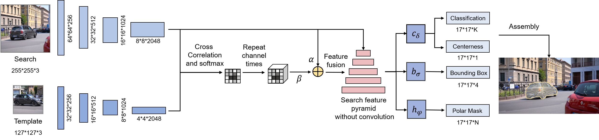

# SiamPolar

This is the codes of [SiamPolar: Realtime Video Object Segmentation with Polar Representation](https://www.sciencedirect.com/science/article/abs/pii/S0925231221014417). 

<div align="center">
	
</div>

If you find this code useful in your research then please cite

```
@article{hong2021siampolar,
  title={SiamPolar: Semi-supervised Realtime Video Object Segmentation with Polar Representation},
  author={Hong, Yuhui and Song, Yonghong and Zhu, Chao and Zhang, Ying and Wang, Ruihao},
  journal={Neurocomputing},
  year={2021},
  publisher={Elsevier}
}
```

## Performances

**1. DAVIS2016**

| Methods         | J_M​  | J_R​  | J_D​  | F_D​  | F_R​  | F_D​  | Speed     |
| --------------- | ---- | ---- | ---- | ---- | ---- | ---- | --------- |
| SiamPolar-light | 66.4 | 89.7 | 0.2  | 50.8 | 52.2 | 0.4  | 63.20 FPS |
| SiamPolar       | 71.4 | 96.2 | 0.7  | 56.7 | 60.0 | 18.1 | 59.20 FPS |

**2. DAVIS2017**

| Methods   | J_M​  | J_R​  | F_D​  | F_R​  | Speed     |
| --------- | ---- | ---- | ---- | ---- | --------- |
| SiamPolar | 55.2 | 69.4 | 39.0 | 23.7 | 59.20 FPS |

## Setup Environment

SiamPolar is implemented on [mmdetection](https://github.com/open-mmlab/mmdetection). It can be installed easily as following, and more details can be seen in `./INSTALL.md`. 

```shell
git clone https://github.com/JosieHong/SiamPolar.git
cd SiamPolar

# conda environment (recommend) 
conda create -n open_mmlab python=3.7 -y
conda activate open_mmlab
# or virtualenv environment
# virtualenv env
# source env/bin/activate

pip install --upgrade pip
# Please install a PyTorch version fitted your CUDA driver 
# from https://pytorch.org/get-started/locally/
pip install -r requirements.txt
pip install "git+https://github.com/cocodataset/cocoapi.git#subdirectory=PythonAPI"

python setup.py develop
# or "pip install -v -e ."
```

If there is any problem with the environment, please check the versions first: 

- CUDA == 10.1
- torch == 1.2.0 
- torchvision == 0.4.0
- mmdet == 1.0rc0+3ad0a02
- mmcv == 0.4.3

## Prepare Dataset

### DAVIS2016

1. Download DAVIS2016 from [kaggle-DAVIS480p](https://www.kaggle.com/mrjb166/davis480p).

2. Convert DAVIS2016 to COCO format by `python ./tools/convert_datasets/davis2coco.py 2016 <path to DAVIS2016 dataset>` and organized it as following: (The files in brackets are not used in SiamPolar.)

```shell
SiamPolar
├── mmdet
├── tools
├── configs
├── data
│  ├── DAVIS
│  │  ├── Annotations
|  |  |  ├── 480p_train.json
|  |  |  ├── 480p_trainval.json
|  |  |  ├── 480p_val.json
|  |  |  ├── (db_info.yml)
|  |  |  ├── (480p)
│  │  ├── (Imageset)
|  |  |  ├── (480p)
|  |  |  |  ├── (train.txt)
|  |  |  |  ├── (trainval.txt)
|  |  |  |  ├── (val.txt)
|  |  |  |  ├── (test.txt)
│  │  ├── JPEGImages
|  |  |  ├── 480p
```

### DAVIS2017

1. Download DAVIS2017 from [DAVIS-2017](https://davischallenge.org/davis2017/code.html).

2. Download `db_info.yml` from [davis-2017/data/db_info.yaml](https://github.com/fperazzi/davis-2017/blob/master/data/db_info.yaml).

3. Convert DAVIS2017 to COCO format by `python ./tools/convert_datasets/davis2coco.py 2017 <path to DAVIS2017 dataset>` and organized it as the structure of DAVIS2016. 

### SegTrack / SegTrack v2

1. Download [SegTrack Dataset](http://cpl.cc.gatech.edu/projects/SegTrack/) / [SegTrack v2](https://web.engr.oregonstate.edu/~lif/SegTrack2/dataset.html).
2. Convert SegTrack / SegTrack v2 to COCO format: 

```bash
# First, please change the file name 'ground_truth' in penguin into 'ground-truth'.

python tools/convert_datasets/segtrack2coco.py [path to SegTrack dataset]
# e.g.
# python tools/convert_datasets/segtrack2coco.py /data1/datasets/SegTrack

python tools/convert_datasets/segtrack2coco_v2.py [path to SegTrack v2 dataset]
```

## Train & Test

SiamPolar can be trained and test as other mmdetection models. For more details, you can read [mmdetection-manual](https://mmdetection.readthedocs.io/en/latest/INSTALL.html) and [mmcv-manual](https://mmcv.readthedocs.io/en/latest/image.html). Please check all the configures of SiamPolar in `./config/siampolar/`. 

```bash
# train
python tools/train.py <path to configure file> --gpus <gpu index> --resume_from <path to pretrained model>

# test
python tools/test.py <path to configure file> <path to pretrained model> \
--out <path to output pkl file> \
--eval vos
```

There are some examples in `./Command_Examples.md`. Please set them to your own configures. 

## Demo

```
cd ./demo
python visualize_vos.py

python visualize_gen_polar.py <path_to_img_dir> <img_name> <polar_num>
```

## License

For academic use, this project is licensed under the 2-clause BSD License - see the LICENSE file for details. For commercial use, please contact the authors. 
