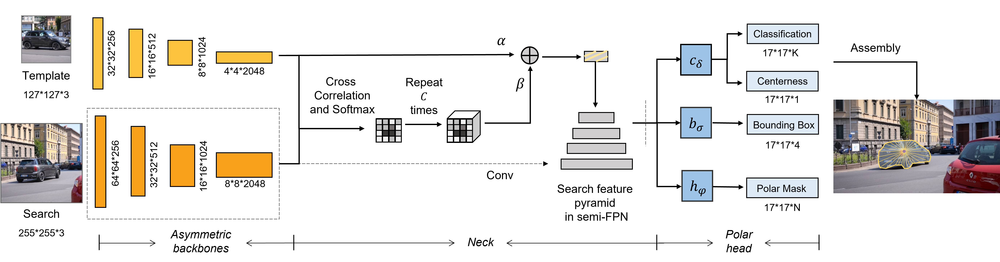

# SiamPolar: Realtime Video Object Segmentation with Polar Representation

This is an implement of SiamPolar on [mmdetection](https://github.com/open-mmlab/mmdetection). 



Figure1.SiamPolar

## Highlights

- **Improved Polar Representation**: We introduce the improved polar representation into video object segmentation, and propose a real-time video object segmentation method SiamPolar. At the same time, this is also an anchor-free object tracking method. 
- **Asymmetric Siamese Network**: Same backbone for the search image and the template image results in the problem of spatial misalignment between the two images. We propose an Asymmetric Siamese Network that uses similar backbones with different depths, which not only improves the problems above but also allows the Siamese Network to use deeper backbones with better performance.
- **Peeling convolutions**: There are negative effects among the branches in Polar Head, so we design Repeated Cross Correlation and Semi-FPN based on the idea of Peeling Convolutions. Without convolution, redundant anti-features would be reduced. Hence the mutual influence between each branch feature would be weakened. 

## Performances


**Results on DAVIS-2016**


## Setup Environment

SiamPolar is implemented on [mmdetection](https://github.com/open-mmlab/mmdetection). It can be installed easily as following, and more details can be seen in `./INSTALL.md`.

```shell
git clone ...
cd SiamPolar
conda create -n open_mmlab python=3.7 -y
source activate open_mmlab

pip install --upgrade pip
pip install cython torch==1.4.0 torchvision==0.5.0 mmcv
pip install -r requirements.txt # ignore the errors
pip install "git+https://github.com/cocodataset/cocoapi.git#subdirectory=PythonAPI"

python setup.py develop
# or "pip install -v -e ."
```

## Prepare DAVIS Dataset

1. Download DAVIS from [kaggle-DAVIS480p](https://www.kaggle.com/mrjb166/davis480p).

2. Convert DAVIS to coco format by `/tools/conver_datasets/davis2coco.py` and organized it as following

```shell
SiamPolar
├── mmdet
├── tools
├── configs
├── data
│  ├── DAVIS
│  │  ├── Annotations
|  |  |  ├── 480p_train.json
|  |  |  ├── 480p_trainval.json
|  |  |  ├── 480p_val.json
|  |  |  ├── db_info.yml
│  │  ├── Imageset
│  │  ├── JPEGImages
```

## Train & Test

It can be trained and test as other mmdetection models. For more details, you can read [mmdetection-manual](https://mmdetection.readthedocs.io/en/latest/INSTALL.html) and [mmcv-manual](https://mmcv.readthedocs.io/en/latest/image.html). This is an example of SiamPolarMask(ResNet50 Backbone). 

```shell
python tools/train.py ./configs/siampolar/siampolar_r101.py --gpus 1

python tools/test.py ./configs/siampolar/siampolar_r101.py \./work_dirs/siam_polarmask_r50/epoch_12.pth \
--out ./work_dirs/siam_polarmask_r50/res.pkl \
--eval vos
```

We also add some configures for SiamPolar like backbone type, polar points number and so on, which can be easily set in `./configs/siampolar/`.

## Demo

```
cd ./demo
python visualize_vos.py
```

## License

For academic use, this project is licensed under the 2-clause BSD License - see the LICENSE file for details. For commercial use, please contact the authors. 
